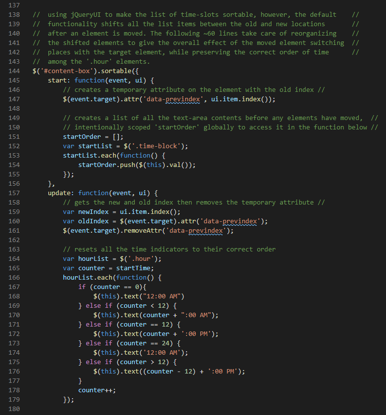
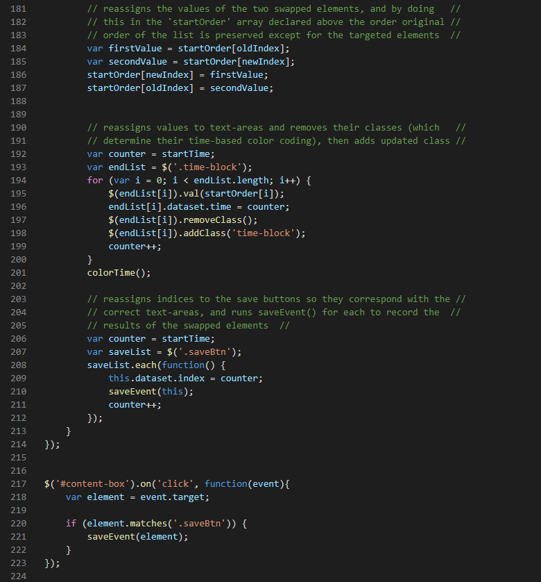

# Work-Day-Scheduler-HW5

- This project was to make a scheduling app that displays the hours of the day as editable time-slots where events can be added then saved to local storage. The project asked for a 9am to 5pm schedule.

- I expanded upon the base features by adding a drop-down form where the user can select a start-time and an end-time which serve as parameters to dynamically generate the specified time-frame.

- Additionally, I added a heavily modified version of jQueryUi's .sortable interaction to allow for drag-and-drop rearranging of the schedule without having to re-type events. 

- this project met all required functional and design criteria, and was then enhanced through the addition of the user-selectable timeframes (made possible by dynamically generating all elements in Javascript) as well as the drag-and-drop functionality (which is explained n greater detail below)
## Installation

No installation required.
Go to [https://bob-w-perez.github.io/Work-Day-Scheduler-HW5/](https://bob-w-perez.github.io/Work-Day-Scheduler-HW5/) to use the application.

The code and all relevant files can be found at [https://github.com/bob-w-perez/Work-Day-Scheduler-HW5](https://github.com/bob-w-perez/Work-Day-Scheduler-HW5). 

## Usage

## Features
- persistent events/entries by storing data in local storage 
- color coded to distinguish past, present, and future time-blocks
- *EXTRA* - defaults to standard 9am to 5pm timeframe which can be adjusted by the user to any timeframe via an intuitive drop-down form
- *EXTRA* - user can drag-and drop events/entries from one time block to any other without disrupting the color coding or other element properties

## Selected Code

The most technically difficult part of this project was getting the drag-and-drop feature to function correctly. It is based off of JQueryUI's .sortable interaction. However, when making something sortable, all list items shift in position when one is move which would not be appropriate for a schedule where the other events need to stay in their designated positions. Additionally, the data attributes of the moved elements needed to dynamically update in order for the color coding function to work properly.

The methods used in this section can generalize to any situation in which one wants to swap the positions of two list elements without causing all the content in between the starting and ending positions to shift.

## Contributing
Solo project for GATech Coding Bootcamp

## License
MIT License

Copyright (c) 2021 Robert Perez

Permission is hereby granted, free of charge, to any person obtaining a copy
of this software and associated documentation files (the "Software"), to deal
in the Software without restriction, including without limitation the rights
to use, copy, modify, merge, publish, distribute, sublicense, and/or sell
copies of the Software, and to permit persons to whom the Software is
furnished to do so, subject to the following conditions:

The above copyright notice and this permission notice shall be included in all
copies or substantial portions of the Software.

THE SOFTWARE IS PROVIDED "AS IS", WITHOUT WARRANTY OF ANY KIND, EXPRESS OR
IMPLIED, INCLUDING BUT NOT LIMITED TO THE WARRANTIES OF MERCHANTABILITY,
FITNESS FOR A PARTICULAR PURPOSE AND NONINFRINGEMENT. IN NO EVENT SHALL THE
AUTHORS OR COPYRIGHT HOLDERS BE LIABLE FOR ANY CLAIM, DAMAGES OR OTHER
LIABILITY, WHETHER IN AN ACTION OF CONTRACT, TORT OR OTHERWISE, ARISING FROM,
OUT OF OR IN CONNECTION WITH THE SOFTWARE OR THE USE OR OTHER DEALINGS IN THE
SOFTWARE.